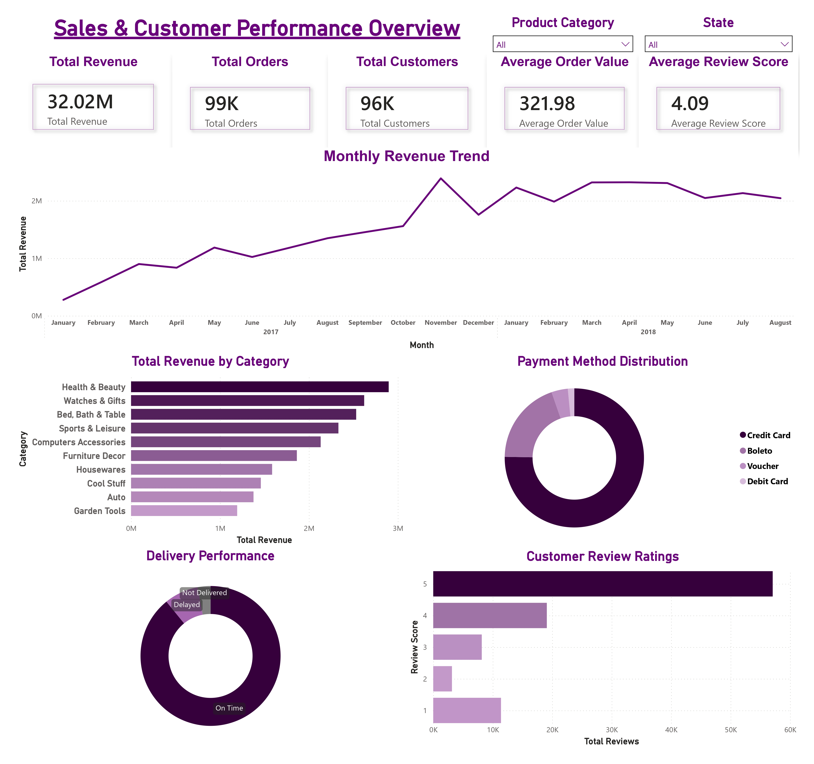
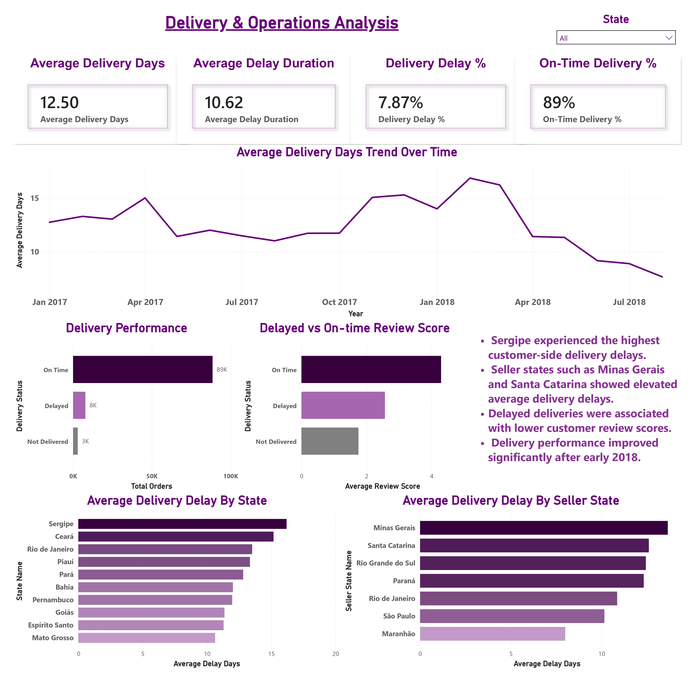
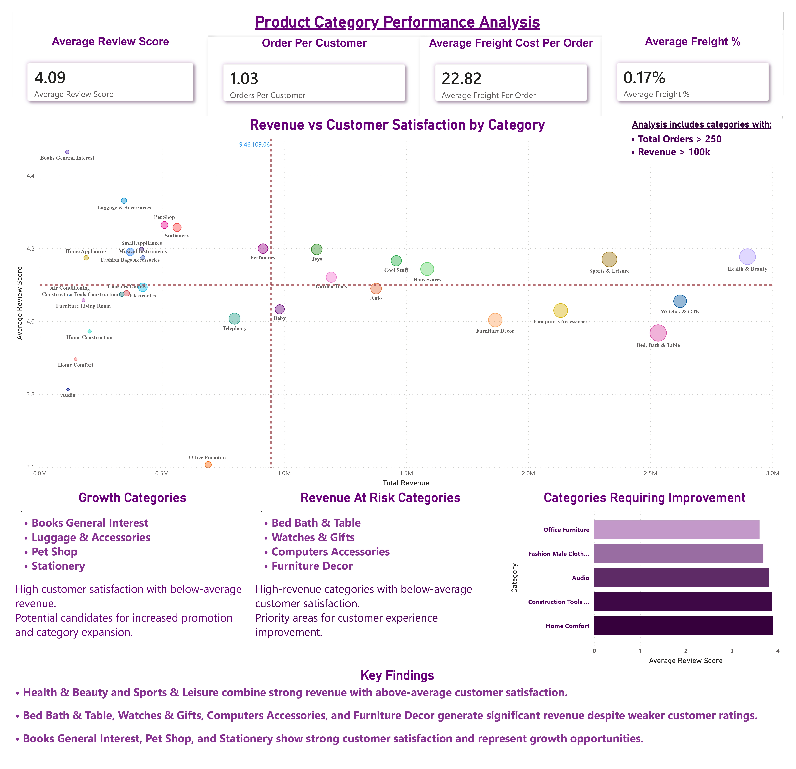
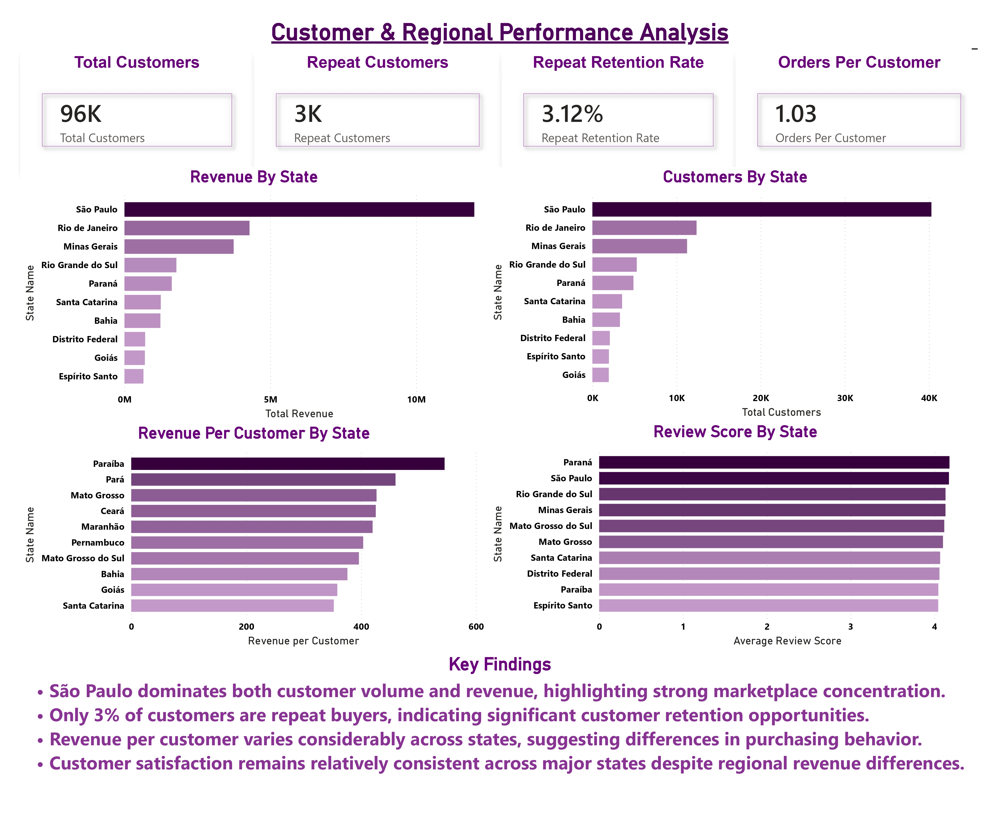

# Olist-Ecommerce-Analytics

## Project Overview

This project analyzes the Brazilian Olist E-Commerce dataset to uncover insights related to sales performance, customer behavior, product category performance, and delivery operations.

Using SQL for data preparation and business analysis and Power BI for interactive visualization, the project transforms raw transactional data into actionable business insights that support data-driven decision-making across revenue growth, customer retention, logistics optimization, and marketplace expansion.

---

## Dashboard Preview

### 1. Sales & Customer Performance Overview



### 2. Delivery & Operations Analysis



### 3. Product Category Performance Analysis



### 4. Customer & Regional Performance Analysis



---

## Business Problem

E-commerce businesses generate large volumes of transactional data across customers, orders, products, payments, reviews, and logistics operations.

The objective of this project was to answer key business questions such as:

* Which product categories generate the highest revenue?
* How has revenue changed over time?
* Which regions contribute the most revenue?
* How do delivery delays affect customer satisfaction?
* Which product categories generate strong revenue but weak customer ratings?
* What opportunities exist to improve customer retention and operational performance?

---

## Dataset

This project uses the Olist Brazilian E-Commerce Public Dataset.

**Dataset Source:**
https://www.kaggle.com/datasets/olistbr/brazilian-ecommerce

The dataset contains information on customers, orders, products, payments, sellers, reviews, and logistics operations from a Brazilian e-commerce marketplace.

### Main Tables

| Table                | Description                              |
| -------------------- | ---------------------------------------- |
| Customers            | Customer information and geographic data |
| Orders               | Order lifecycle and delivery timestamps  |
| Order Items          | Products sold within each order          |
| Payments             | Payment transactions and values          |
| Products             | Product attributes and categories        |
| Sellers              | Seller location information              |
| Reviews              | Customer review scores                   |
| Category Translation | Portuguese to English category mapping   |

### Data Model

```text
Customers
    ↓
Orders
    ↓
Order Items ──→ Products
    ↓
Payments
    ↓
Reviews

Order Items
    ↓
Sellers
```

---

## Tools & Technologies

* SQL (PostgreSQL)
* Power BI
* DAX
* Data Modeling
* Data Cleaning & Transformation
* Business Intelligence
* Dashboard Design

---

## Data Preparation

Before analysis, the dataset was cleaned and standardized to ensure accuracy and consistency.

### Data Cleaning Activities

* Converted order-related timestamp columns from VARCHAR to TIMESTAMP.
* Handled missing timestamp values using NULLIF().
* Performed data quality validation checks.
* Standardized delivery-related date fields.
* Prepared data for KPI calculations and time-series analysis.

### SQL Modules

* 01_data_cleaning.sql
* 02_kpi_analysis.sql
* 03_sales_analysis.sql
* 04_customer_analysis.sql
* 05_logistics_analysis.sql

---

# Dashboard Overview

The Power BI dashboard consists of four business-focused analytical pages.

---

## 1. Sales & Customer Performance Overview

### KPIs

| KPI                  | Value  |
| -------------------- | ------ |
| Total Revenue        | 32.02M |
| Total Orders         | 99K    |
| Total Customers      | 96K    |
| Average Order Value  | 321.98 |
| Average Review Score | 4.09   |

### Analysis Included

* Monthly Revenue Trend
* Revenue by Product Category
* Payment Method Distribution
* Delivery Performance Overview
* Customer Review Distribution

### Key Insights

* Revenue demonstrated strong growth throughout 2017 and early 2018.
* November 2017 recorded the highest monthly revenue, likely influenced by Black Friday and seasonal promotions.
* Health & Beauty, Watches & Gifts, and Bed Bath & Table generated the highest revenue.
* Credit Card payments accounted for the majority of transactions.
* Customer satisfaction remained consistently high with an average review score above 4.

---

## 2. Delivery & Operations Analysis

### KPIs

| KPI                    | Value      |
| ---------------------- | ---------- |
| Average Delivery Days  | 12.50      |
| Average Delay Duration | 10.62 Days |
| Delivery Delay Rate    | 7.87%      |
| On-Time Delivery Rate  | 89%        |

### Analysis Included

* Delivery Performance Analysis
* Average Delivery Time Trend
* Delayed vs On-Time Customer Ratings
* Delivery Delay by Customer State
* Delivery Delay by Seller State

### Key Insights

* Most orders were delivered on time.
* Delayed deliveries received significantly lower review scores than on-time deliveries.
* Delivery performance improved throughout 2018.
* Certain regions experienced consistently higher delays, highlighting opportunities for logistics optimization.

---

## 3. Product Category Performance Analysis

### KPIs

| KPI                            | Value |
| ------------------------------ | ----- |
| Average Review Score           | 4.09  |
| Orders per Customer            | 1.03  |
| Average Freight Cost per Order | 22.82 |

### Analysis Included

* Revenue vs Customer Satisfaction by Category
* Growth Opportunity Categories
* Revenue-at-Risk Categories
* Category Performance Matrix

### Key Insights

* Health & Beauty and Sports & Leisure combine strong revenue with high customer satisfaction.
* Bed Bath & Table, Watches & Gifts, Computers Accessories, and Furniture Decor generate substantial revenue despite below-average ratings.
* Books General Interest, Pet Shop, and Stationery demonstrate strong satisfaction and future growth potential.
* Office Furniture recorded the lowest customer satisfaction among major categories.

---

## 4. Customer & Regional Performance Analysis

### KPIs

| KPI                   | Value |
| --------------------- | ----- |
| Total Customers       | 96K   |
| Repeat Customers      | 3K    |
| Repeat Retention Rate | 3.12% |
| Orders per Customer   | 1.03  |

### Analysis Included

* Revenue by State
* Customers by State
* Revenue per Customer by State
* Review Score by State

### Key Insights

* São Paulo generated the highest revenue and customer volume.
* Revenue is concentrated among a small number of high-performing states.
* Only 3% of customers make repeat purchases, highlighting a significant retention opportunity.
* Customer satisfaction remains relatively stable across regions.

---

# Business Recommendations

## 1. Improve Customer Retention

Only a small percentage of customers place repeat orders.

**Recommendations:**

* Implement loyalty programs.
* Launch personalized marketing campaigns.
* Develop customer retention initiatives.
* Improve post-purchase engagement.

---

## 2. Reduce Delivery Delays

Delivery delays have a significant impact on customer satisfaction.

**Recommendations:**

* Optimize logistics operations.
* Improve fulfillment efficiency.
* Monitor regional delivery bottlenecks.
* Strengthen logistics partnerships.

---

## 3. Focus on High-Revenue Categories

A small number of categories drive a significant portion of total revenue.

**Recommendations:**

* Increase marketing investment.
* Improve inventory planning.
* Expand category-specific promotional campaigns.

---

## 4. Improve Low-Rated Categories

Certain categories generate revenue but receive weaker customer ratings.

**Recommendations:**

* Review supplier quality.
* Improve product descriptions.
* Strengthen customer support processes.
* Address category-specific customer pain points.

---

# Project Outcomes

This project demonstrates:

* End-to-End Data Analytics Workflow
* SQL-Based Business Analysis
* Data Cleaning and Transformation
* Data Modeling
* KPI Development
* DAX Calculations
* Interactive Dashboard Design
* Business Insight Generation
* Data-Driven Decision Making

---

## Repository Structure

```text
Olist-Ecommerce-Analytics/
│
├── README.md
│
├── SQL/
│   ├── 01_data_cleaning.sql
│   ├── 02_kpi_analysis.sql
│   ├── 03_sales_analysis.sql
│   ├── 04_customer_analysis.sql
│   └── 05_logistics_analysis.sql
│
├── Screenshots/
│   ├── olist_report_page-0001.jpg
│   ├── olist_report_page-0002.jpg
│   ├── olist_report_page-0003.jpg
│   └── olist_report_page-0004.jpg
│
└── docs/
    └── Olist_Project_Report.pdf
```

---

## Author

**Dasamantharao Venkat Anuj**

Data Analytics Portfolio Project
